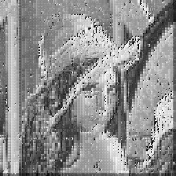

# Fracture

Fracture is a [fractal image encoder](https://steelpangolin.wordpress.com/2014/07/09/a-review-of-fractal-image-compression-and-related-algorithms/) intended for high-quality image enlargement. It contains [a GPGPU hardware-accelerated fractal image encoder](src/) (implemented as OpenGL shader programs suitable for the GeForce 7600), as well as [a software reference encoder and decoder](test/fpimage.py) (implemented in Python).

## Examples

Here's Lena after being reduced 2✕ and then enlarged 2✕. Note where the conventional upscaler's output is blurry, Fracture's output preserves lines and texture.

original | conventional upscaler | Fracture software encoder | Fracture GPU encoder
--- | --- | --- | ---
 |  |  | 

See [my presentation on "GPU-accelerated fractal imaging"](docs/CS%2081.pptx.pdf) for more of what Fracture can do.

## Notes

This is research-grade code from 2009, it's written for Mac OS X, it uses shader programs instead of OpenCL or CUDA, and it was only ever tested on the embedded GeForce 7600 in my iMac. Fracture may require a little tweaking to run on modern Macs, and it'll definitely take some work to run Fracture on Linux, FreeBSD, or Windows.
